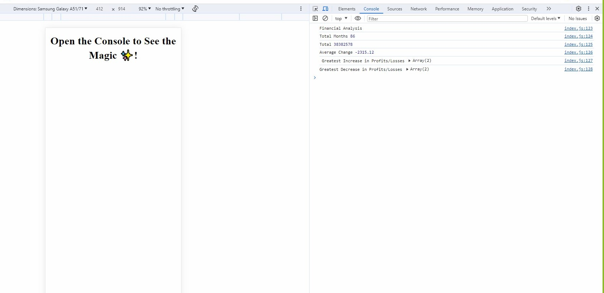

# Week 4 Challenge:  Console-Finances

# Description: 

   
I have focused here on analyzing a Financial project of a corporate company. Here, I have got a dataset from the years Jan-2010 to Feb-2017 with profits/losses.The maximum profit and loss have been presented here. The average has been calculated on the basis of the total figure of 86 months.  
  

Since I'm going through the learning process of JavaScript, therefore I wanted to try the application of it.

# Screen shot:

